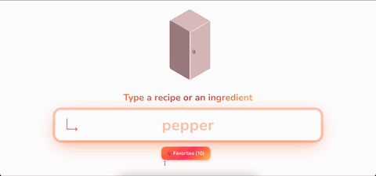
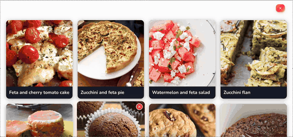

<div>
  <h1>Find Me a Recipe</h1>
  <p><strong>From leftover ingredients to full recipes – fast, smart, multilingual.</strong></p>

  <p>
    <a href="https://www.typescriptlang.org/"></a>
    <a href="https://react.dev/"></a>
    <a href="https://flask.palletsprojects.com/"></a>
    <a href="https://www.python.org/"></a>
    <a href="LICENSE"></a>
  </p>
</div>

<hr/>

## Overview

**Find Me a Recipe** helps you discover recipes matched to what you already have. Instead of searching blindly, you get curated, ingredient‑aware suggestions with minimal external shopping.

| Impact | Description |
|--------|-------------|
| Less Waste | Use ingredients before they expire |
| Cost Efficient | Avoid buying unnecessary items |
| Fast Discovery | Async scraping & caching reduce latency |
| Multilingual | English / French with intelligent translation |
| Favorites | Save, revisit, and organize liked recipes |
| Relevance | Filters out recipes needing many missing items |

---

---

## Features

<table>
<thead><tr><th>Category</th><th>Highlights</th></tr></thead>
<tbody>
<tr><td><strong>Discovery</strong></td><td>Ingredient-driven search · Minimal missing items · Real-time scraping · High-res images</td></tr>
<tr><td><strong>UX</strong></td><td>Swipe navigation · Animated favorites · Sticky sections · Responsive layout</td></tr>
<tr><td><strong>Localization</strong></td><td>English/French UI · Smart translation of queries · Language-specific caching</td></tr>
<tr><td><strong>Performance</strong></td><td>Async batch fetch · Server + client caching · Optimized DOM & CSS · Efficient parsing</td></tr>
<tr><td><strong>Developer</strong></td><td>Automated tests · Structured logging · Single start script · Dockerized environment</td></tr>
</tbody>
</table>

---

## Demo

<div align="center">
  <h3>Ingredient Input</h3>
  
  <p style="margin-top:8px; font-style:italic; color:#666;">Visual ingredient building with instant feedback.</p>
  <hr style="border:none;height:1px;background:#eee;width:60%;margin:28px auto;"/>
  <h3>Recipe Swiping</h3>
  
  <p style="margin-top:8px; font-style:italic; color:#666;">Gesture‑based browsing for fast suggestion exploration.</p>
  <hr style="border:none;height:1px;background:#eee;width:60%;margin:28px auto;"/>
  <h3>Favorites Management</h3>
  
  <p style="margin-top:8px; font-style:italic; color:#666;">Instant add/remove with clear visual confirmation.</p>
</div>

### Lightweight Versions (optional)
If GIFs are too heavy, generate compressed variants or reduce dimensions:
```bash
# Recommended (optimized palette)
ffmpeg -i docs/videos/searchBar.mp4 -vf "fps=12,scale=400:-1:flags=lanczos,split[s0][s1];[s0]palettegen=max_colors=96[p];[s1][p]paletteuse=dither=bayer:bayer_scale=5" -loop 0 docs/images/searchBar-small.gif
ffmpeg -i docs/videos/swipe.mp4 -vf "fps=12,scale=400:-1:flags:lanczos,split[s0][s1];[s0]palettegen=max_colors=96[p];[s1][p]paletteuse=dither=bayer:bayer_scale=5" -loop 0 docs/images/swipe-small.gif
ffmpeg -i docs/videos/favorite.mp4 -vf "fps=12,scale=400:-1:flags=lanczos,split[s0][s1];[s0]palettegen=max_colors=96[p];[s1][p]paletteuse=dither=bayer:bayer_scale=5" -loop 0 docs/images/favorite-small.gif
```

### MP4 Sources (maximum quality)
`searchBar.mp4`, `swipe.mp4`, `favorite.mp4` in `docs/videos/` (ideal for external hosting or embedded pages).

### Performance Tips
- Keep preview GIFs short (<15s); use MP4/WebM for longer demos.
- Reduced palette (96–128 colors) greatly lowers file size.
- Keep width ≤ 520px for readability without excessive load.

---

## Quick Start

```bash
# Single command (auto: tests → docker or local fallback)
npm start
```

Opens frontend at `http://localhost:3000` and backend at `http://localhost:5001` (Docker) or chosen local port.

### Prerequisites
Node 18+, Python 3.12+, optional Docker.

### Alternative Setups

<details>
<summary><strong>▶ Docker workflow</strong></summary>

```bash
npm run docker:up            # build + start
npm run docker:down          # stop
```
</details>

<details>
<summary><strong>▶ Local (no Docker)</strong></summary>

```bash
# Frontend
cd client
npm install
npm start

# Backend (separate terminal)
cd flask-server
poetry install
poetry run flask --app app run
```
</details>

---


## Tech Stack

| Layer | Technologies |
|-------|-------------|
| Frontend | React 19 · TypeScript · Anime.js · CSS Variables · Jest/RTL |
| Backend | Flask · BeautifulSoup4 · aiohttp · asyncio · deep-translator |
| Infra | Docker · Docker Compose · Poetry · npm |
| Quality | Structured logging · Automated tests on start · Caching tiers |

---

---

## Architecture

### High-Level Overview

```
┌─────────────────────────────────────────────────────────────┐
│                         Client (React)                       │
│  ┌──────────────┐  ┌──────────────┐  ┌──────────────┐      │
│  │  Language     │  │  Recipe      │  │  Favorites   │      │
│  │  Context      │  │  Cache       │  │  Manager     │      │
│  └──────────────┘  └──────────────┘  └──────────────┘      │
│           │                  │                  │            │
│           └──────────────────┴──────────────────┘            │
│                              ▼                               │
│                    ┌──────────────────┐                      │
│                    │   API Client      │                      │
│                    └──────────────────┘                      │
└────────────────────────────┬────────────────────────────────┘
                              │ HTTP/JSON
                              ▼
┌─────────────────────────────────────────────────────────────┐
│                     Flask Backend (Python)                   │
│  ┌──────────────┐  ┌──────────────┐  ┌──────────────┐      │
│  │  Routes       │  │  Translator  │  │  Cache       │      │
│  │  /research    │  │  (i18n)      │  │  (Redis-like)│      │
│  │  /detailed    │  │              │  │              │      │
│  │  /ingredient  │  │              │  │              │      │
│  └──────────────┘  └──────────────┘  └──────────────┘      │
│           │                  │                  │            │
│           └──────────────────┴──────────────────┘            │
│                              ▼                               │
│                    ┌──────────────────┐                      │
│                    │   Marmiton       │                      │
│                    │   Scraper        │                      │
│                    └──────────────────┘                      │
└────────────────────────────┬────────────────────────────────┘
                              │ HTTP
                              ▼
                    ┌──────────────────┐
                    │   Marmiton.org   │
                    │   (Recipe Site)  │
                    └──────────────────┘
```

## Testing

### Run All Tests

```bash
# Frontend tests (Jest + React Testing Library)
cd client && npm test

# Backend tests (unittest)
cd flask-server && python test_app.py

# Or with Docker
docker-compose exec flask python test_app.py
```

### Coverage & Automation
Frontend (Jest): Components · Context · Utils. Backend (unittest): Routes · Translation · Image fetch. All executed automatically pre-start via `npm start`.

---

---

## API


#### POST `/research_recipe`
Request:
```json
{"ingredients":["tomato","cheese"],"language":"en"}
```
Response (excerpt):
```json
{"recipes":[{"name":"Pasta Caprese","image":"https://...","rate":"4.5"}]}
```

#### POST `/detailed_recipe`
Request:
```json
{"recipe_name":"Pasta Caprese","language":"en"}
```

#### GET `/ingredient_image?query=tomato&language=en`
Returns an image URL or generated placeholder.

---

---

## Author

**Thibault Nieuviarts**

- Email: thibault.nieuviarts@gmail.com
- GitHub: [@Fordann](https://github.com/Fordann)

---

## Roadmap

- [ ] Add more recipe sources (AllRecipes, BBC Good Food)
- [ ] User accounts and cloud-saved favorites
- [ ] Advanced filters (dietary restrictions, cuisine type)
- [ ] Meal planning calendar
- [ ] Shopping list generation
- [ ] Nutritional information
- [ ] Recipe ratings and reviews
- [ ] Social sharing features
- [ ] Mobile app (React Native)

---

<div align="center">

</div>
